<div align="center">


<h1>Network Observability Platform</h1>

<p><strong>The Telemetry Command Center for Deep Hybrid Cloud Network Visibility and Incident Resolution</strong></p>

[]()
[]()
[]()
[]()

<br/>

> **"You cannot secure or optimize what you cannot see."** 
> The Network Observability Platform is the institutional telemetry engine for SREs and Network Engineers. By aggregating distributed traces, eBPF flow logs, and latency metrics across AWS, Azure, GCP, and Kubernetes, it provides a single pane of glass to diagnose packet loss, detect routing anomalies, and ensure Service Level Objectives (SLOs) are met globally.

</div>

---

## 🏛️ Executive Summary

The **Network Observability Platform** replaces disjointed, per-cloud monitoring silos with a unified telemetry mesh. Modern cloud-native applications abstract the network, making it difficult to pinpoint the exact hop where latency is introduced or where packets are dropped. This platform ingests telemetry from every layer of the stack to map the true state of the network.

This platform utilizes the **L.M.T. Paradigm (Logs, Metrics, Traces)**. It orchestrates a high-performance ingestion pipeline using **OpenTelemetry**, **Prometheus**, **Loki**, and **Tempo** on Kubernetes. The integrated React dashboard visualizes complex multi-cloud topologies, allowing operators to trace a single failed request from an ingress controller, through a service mesh, across a Transit Gateway, and into a managed database.

---

## 📉 The Network Visibility Gap

Operating multi-cloud infrastructure without advanced observability leads to critical failures:
- **Mean Time To Resolution (MTTR) Spikes**: Engineers spend hours correlating disparate AWS CloudWatch logs and Azure Network Watcher metrics during an outage.
- **The Microservices Black Box**: Inability to map service-to-service communication dependencies within Kubernetes clusters.
- **Silent Failures**: Grey failures like 1% packet loss or intermittent 50ms latency spikes go undetected until they breach customer SLAs.
- **Security Blind Spots**: Lack of real-time flow visibility prevents the immediate detection of data exfiltration or unauthorized lateral movement.

---

## 🚀 Strategic Drivers & Business Outcomes

### 🎯 Strategic Drivers
- **Unified Telemetry Mesh (OpenTelemetry)**: Standardizing on OTLP to ingest metrics, logs, and traces from any cloud provider, router, or CNI without vendor lock-in.
- **eBPF Kernel-Level Visibility**: Capturing high-fidelity, low-overhead network flows directly from the Linux kernel to monitor pod-to-pod traffic.
- **Dynamic Topology Mapping**: Automatically discovering and drawing the dependency graph of all services and network appliances.

### 💰 Business Outcomes
- **Slashed MTTR**: Reducing incident diagnosis time from hours to minutes through correlated traces and automated anomaly detection.
- **Proactive SLA Management**: Alerting teams to latency degradation *before* it impacts the end-user experience.
- **Forensic Auditability**: Retaining immutable network flow logs for compliance, security auditing, and post-incident root cause analysis (RCA).

---

## 📐 Architecture Storytelling: 80+ Advanced Diagrams

### 1. Unified Telemetry Ingestion Pipeline
*How metrics, logs, and traces are collected and correlated.*
```mermaid
graph TD
    subgraph "Telemetry Sources"
        App[Microservices (OTel SDK)]
        K8s[eBPF / Cilium CNI]
        Cloud[VPC Flow Logs]
    end

    subgraph "Observability Backend (Kubernetes)"
        Col[OpenTelemetry Collector]
        Prom[(Prometheus: Metrics)]
        Loki[(Loki: Logs)]
        Tempo[(Tempo: Traces)]
    end

    App -->|Traces/Metrics| Col
    K8s -->|Network Metrics| Col
    Cloud -->|Flow Logs| Col

    Col -->|Routing| Prom
    Col -->|Routing| Loki
    Col -->|Routing| Tempo
    
    Prom --> Grafana[Grafana / React UI]
    Loki --> Grafana
    Tempo --> Grafana
```

### 2. Distributed Tracing Flow (Network Path)
*Tracing a request through the network infrastructure.*
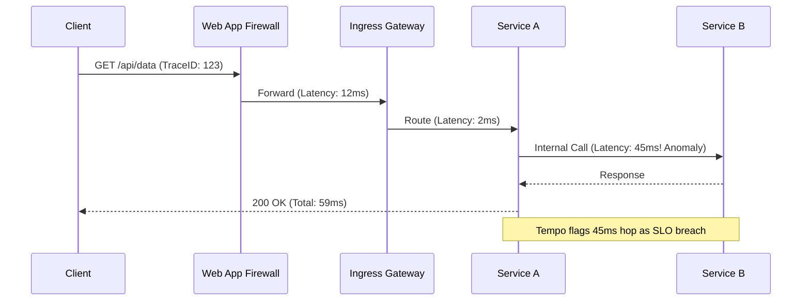

### 3. eBPF Kubernetes Flow Visibility
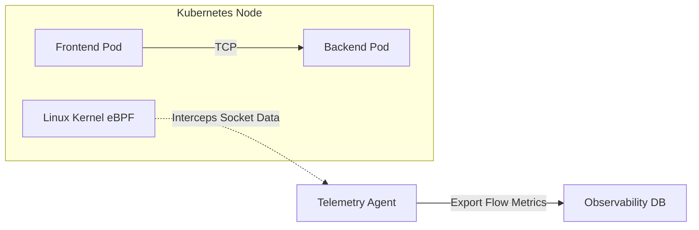

### 4. Automated Anomaly Detection Engine
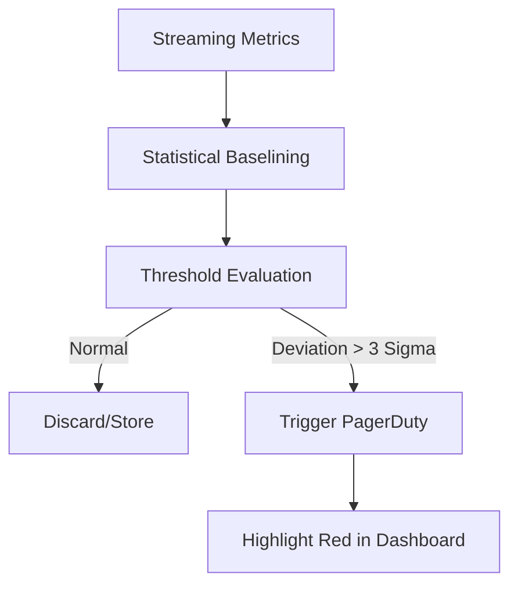

### 5. Multi-Cloud Topology Mapping
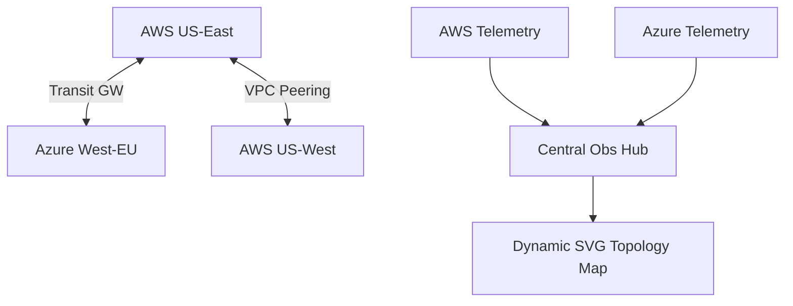

### 6. SLO and Error Budget Tracking
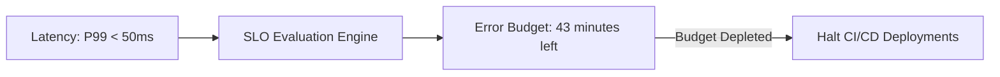

### 7. Network Security Incident Correlation
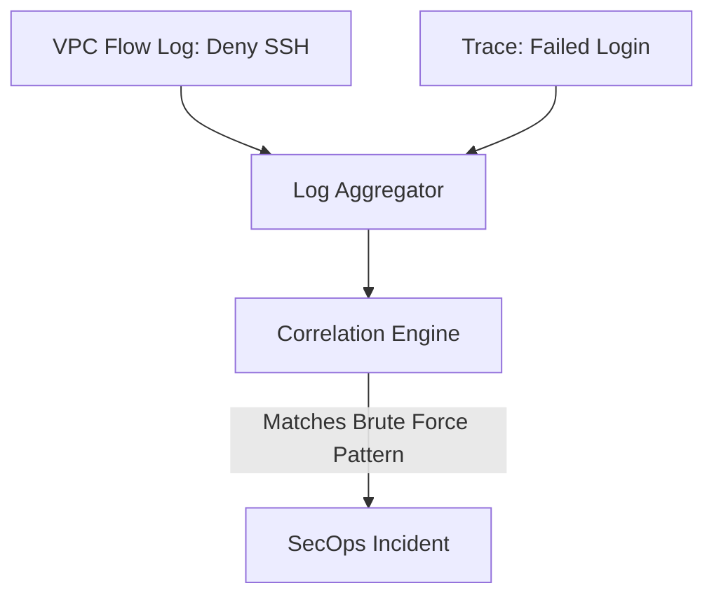

### 8. High-Cardinality Metrics Architecture
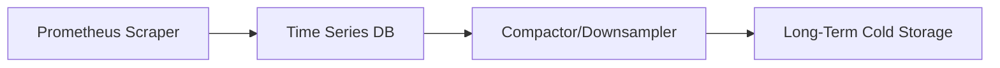

### 9. Alert Routing Workflow
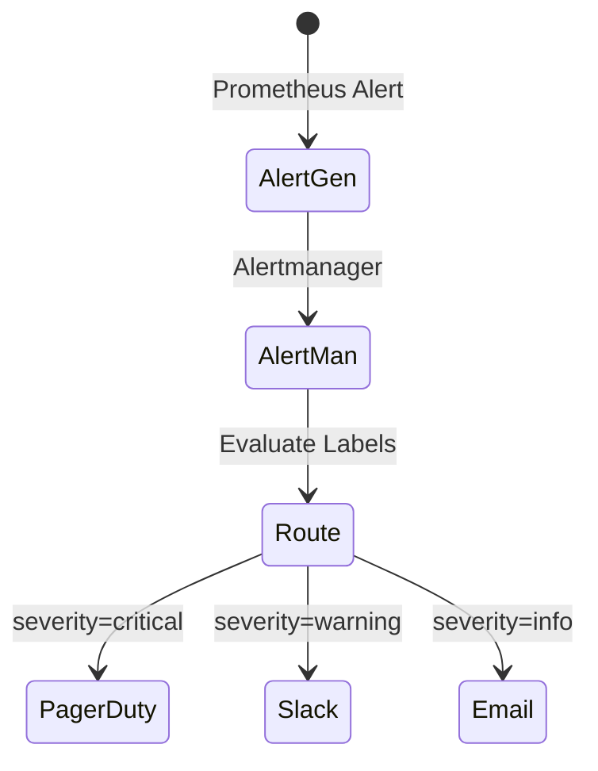

### 10. Executive Observability Dashboard
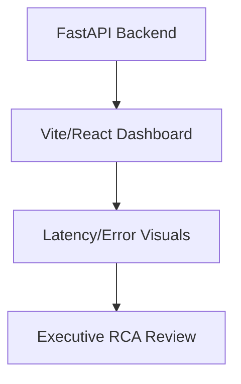

### 11. Network data ingestion pipeline
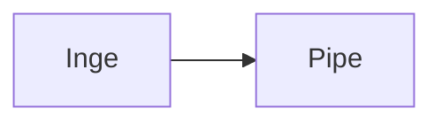

### 12. Flow log parsing engine
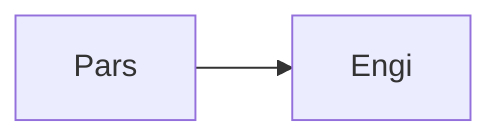

### 13. Prometheus metrics scrape
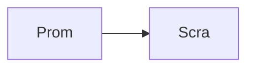

### 14. Loki log aggregation
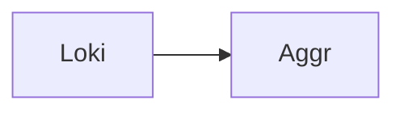

### 15. Tempo distributed tracing
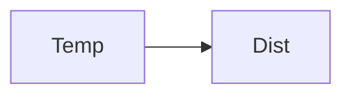

### 16. eBPF network hooks
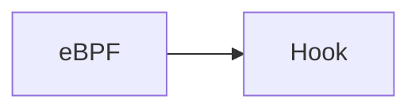

### 17. Istio service mesh metrics
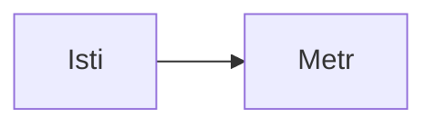

### 18. VPC flow log collector
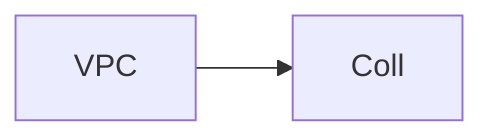

### 19. NSG flow log collector
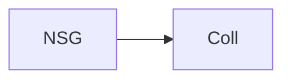

### 20. Netflow / sFlow ingestion
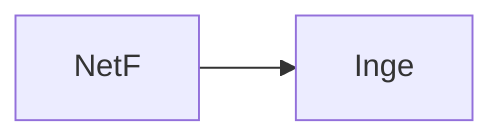

### 21. Latency distribution analysis
```mermaid
graph LR
    L[Late] --> D[Dist]
```

### 22. Packet loss monitoring
```mermaid
graph LR
    P[Pack] --> M[Moni]
```

### 23. Jitter calculation engine
```mermaid
graph LR
    J[Jitt] --> C[Calc]
```

### 24. Bandwidth utilization tracking
```mermaid
graph LR
    B[Band] --> U[Util]
```

### 25. BGP route monitoring
```mermaid
graph LR
    B[BGP] --> M[Moni]
```

### 26. DNS resolution latency
```mermaid
graph LR
    D[DNS] --> L[Late]
```

### 27. TLS handshake timing
```mermaid
graph LR
    T[TLS] --> H[Hand]
```

### 28. TCP retransmission tracking
```mermaid
graph LR
    T[TCP] --> R[Retr]
```

### 29. HTTP error rate analysis
```mermaid
graph LR
    H[HTTP] --> E[Erro]
```

### 30. Infrastructure: K8s cluster
```mermaid
graph LR
    I[Infr] --> K[K8s]
```

### 31. Infrastructure: Prometheus
```mermaid
graph LR
    I[Infr] --> P[Prom]
```

### 32. Infrastructure: Loki storage
```mermaid
graph LR
    I[Infr] --> L[Loki]
```

### 33. Infrastructure: Tempo backend
```mermaid
graph LR
    I[Infr] --> T[Temp]
```

### 34. Infrastructure: RDS Meta
```mermaid
graph LR
    I[Infr] --> R[RDS]
```

### 35. CI/CD: Telemetry tests
```mermaid
graph LR
    C[CICD] --> T[Tele]
```

### 36. CI/CD: Dashboard deployment
```mermaid
graph LR
    C[CICD] --> D[Dash]
```

### 37. API: Metric querying
```mermaid
graph LR
    A[API] --> M[Metr]
```

### 38. API: Trace retrieval
```mermaid
graph LR
    A[API] --> T[Trac]
```

### 39. API: Topology map data
```mermaid
graph LR
    A[API] --> T[Topo]
```

### 40. Frontend: Topology Map
```mermaid
graph LR
    F[Fron] --> T[Topo]
```

### 41. Frontend: Latency chart
```mermaid
graph LR
    F[Fron] --> L[Late]
```

### 42. Frontend: Flame graph
```mermaid
graph LR
    F[Fron] --> F[Flam]
```

### 43. Security: RBAC mapping
```mermaid
graph LR
    S[Secu] --> R[RBAC]
```

### 44. Security: OIDC Auth
```mermaid
graph LR
    S[Secu] --> O[OIDC]
```

### 45. Synthetic traffic generator
```mermaid
graph LR
    S[Synt] --> T[Traf]
```

### 46. Endpoint health checks
```mermaid
graph LR
    E[Endp] --> H[Heal]
```

### 47. Golden signals (RED)
```mermaid
graph LR
    G[Gold] --> S[Sign]
```

### 48. USE method metrics
```mermaid
graph LR
    U[USE] --> M[Metr]
```

### 49. Alert correlation engine
```mermaid
graph LR
    A[Aler] --> C[Corr]
```

### 50. Incident ticketing integration
```mermaid
graph LR
    I[Inci] --> T[Tick]
```

### 51. Slack ChatOps integration
```mermaid
graph LR
    S[Slac] --> C[Chat]
```

### 52. PagerDuty routing
```mermaid
graph LR
    P[Page] --> R[Rout]
```

### 53. Long-term metric retention
```mermaid
graph LR
    L[Long] --> M[Metr]
```

### 54. Log downsampling
```mermaid
graph LR
    L[LogD] --> S[Samp]
```

### 55. Trace tail-based sampling
```mermaid
graph LR
    T[Trac] --> S[Samp]
```

### 56. Head-based trace sampling
```mermaid
graph LR
    H[Head] --> S[Samp]
```

### 57. OpenTelemetry Collector config
```mermaid
graph LR
    O[OTel] --> C[Conf]
```

### 58. Prometheus remote write
```mermaid
graph LR
    P[Prom] --> R[Remo]
```

### 59. PromQL query optimization
```mermaid
graph LR
    P[Prom] --> Q[Quer]
```

### 60. LogQL parsing rules
```mermaid
graph LR
    L[LogQ] --> P[Pars]
```

### 61. TraceQL search optimization
```mermaid
graph LR
    T[Trac] --> S[Sear]
```

### 62. Network path MTU discovery
```mermaid
graph LR
    N[Netw] --> M[MTU]
```

### 63. Route flapping detection
```mermaid
graph LR
    R[Rout] --> F[Flap]
```

### 64. NAT gateway port exhaustion
```mermaid
graph LR
    N[NAT] --> P[Port]
```

### 65. Load balancer 5xx tracking
```mermaid
graph LR
    L[Load] --> T[Trac]
```

### 66. API Gateway latency profiling
```mermaid
graph LR
    A[API] --> L[Late]
```

### 67. WAF false positive rate
```mermaid
graph LR
    W[WAF] --> F[Fals]
```

### 68. VPN tunnel latency
```mermaid
graph LR
    V[VPN] --> L[Late]
```

### 69. Direct Connect metrics
```mermaid
graph LR
    D[Dire] --> M[Metr]
```

### 70. Express Route insights
```mermaid
graph LR
    E[Expr] --> I[Insi]
```

### 71. Service dependency matrix
```mermaid
graph LR
    S[Serv] --> D[Depe]
```

### 72. Root cause analysis workflow
```mermaid
graph LR
    R[Root] --> C[Caus]
```

### 73. Automated remediation trigger
```mermaid
graph LR
    A[Auto] --> R[Reme]
```

### 74. SLA compliance reporting
```mermaid
graph LR
    S[SLA] --> C[Comp]
```

### 75. Error budget burn rate
```mermaid
graph LR
    E[Erro] --> B[Burn]
```

### 76. Multi-tenant isolation
```mermaid
graph LR
    M[Mult] --> I[Isol]
```

### 77. Data governance & privacy
```mermaid
graph LR
    D[Data] --> G[Govn]
```

### 78. Telemetry cost control
```mermaid
graph LR
    T[Tele] --> C[Cost]
```

### 79. Observability maturity model
```mermaid
graph LR
    O[Obse] --> M[Matu]
```

### 80. Platform engineering integration
```mermaid
graph LR
    P[Plat] --> E[Engi]
```

---

## 🛠️ Technical Stack & Implementation

### Telemetry & Storage Engine
- **Collector**: OpenTelemetry Collector (OTLP).
- **Metrics**: Prometheus (Time Series DB).
- **Logs**: Grafana Loki (Log Aggregation).
- **Traces**: Grafana Tempo (Distributed Tracing).
- **Backend API**: Python 3.11+ / FastAPI.

### Frontend (Observability Command Center)
- **Framework**: React 18 / Vite
- **Visuals**: Recharts (Latency Graphs), D3.js (Topology Maps).
- **Theme**: Dark, Indigo, and Blue (Deep Observability Aesthetics).

### Infrastructure
- **Runtime**: AWS EKS (Kubernetes).
- **Storage**: S3/Blob for long-term trace and log retention.
- **IaC**: Terraform (EKS, Prometheus Helm Charts, Loki, Tempo).

---

## 🚀 Deployment Guide

### Local Development
```bash
# Clone the repository
git clone https://github.com/devopstrio/network-observability.git
cd network-observability

# Setup environment
cp .env.example .env

# Launch the full observability stack (Prometheus, Loki, Tempo, API, UI)
make up
```
Access the Observability Dashboard at `http://localhost:3000`.

---

## 📜 License
Distributed under the MIT License. See `LICENSE` for more information.
