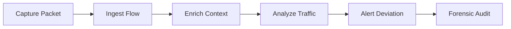
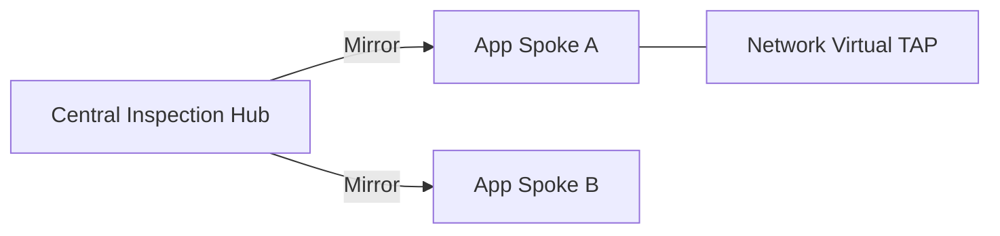
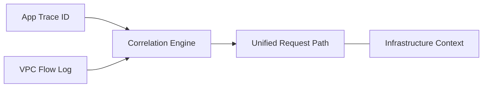
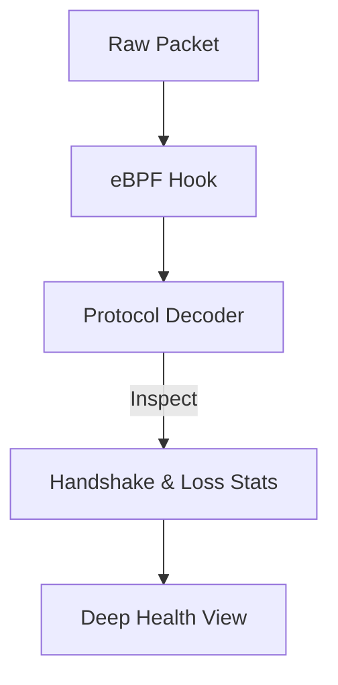
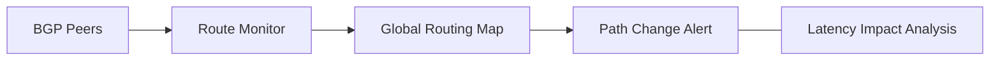
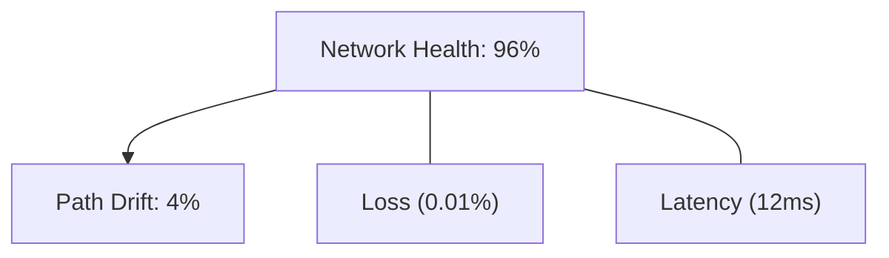
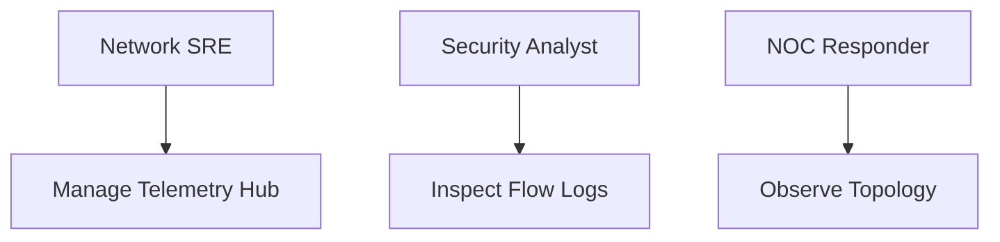
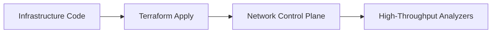
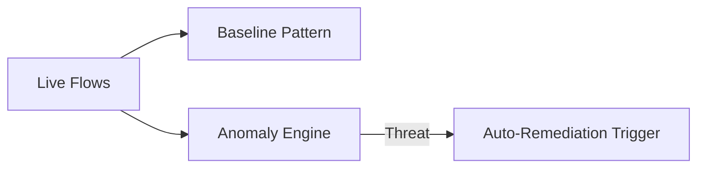
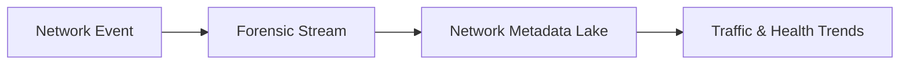

<div align="center">


<h1>Network Observability Platform</h1>

<p><strong>The Institutional Command Center for Deep Hybrid Cloud Network Visibility, Traffic Intelligence, and Incident Resolution.</strong></p>

[]()
[]()
[]()

<br/>

> **"You cannot secure or optimize what you cannot see."** 
> **Network Observability** is an enterprise-grade platform designed to provide a secure, measurable, and highly automated foundation for global network visibility. It orchestrates the complex lifecycle of network telemetry—from kernel-level traffic capture and multi-cloud flow ingestion to real-time traffic intelligence and unified SRE-driven governance.

</div>

---

## 🏛️ Executive Summary

Fragmented network monitoring silos and invisible traffic paths are strategic operational liabilities; lack of centralized network observability is a primary barrier to organizational reliability. Organizations fail to maintain a stable network not because of a lack of bandwidth, but because of fragmented telemetry standards, lack of packet-level visibility, and an inability to map complex multi-cloud traffic flows with operational precision.

This platform provides the **Traffic Intelligence Plane**. It implements a complete **Enterprise Observability-as-Code Framework**, enabling SRE and Network teams to manage infrastructure visibility as a first-class citizen. By automating the capture of distributed network signals and orchestrating real-time flow correlation, we ensure that every organizational asset—from global edge transit gateways to backend microservice meshes—is observable by default, audited for history, and strictly aligned with institutional reliability SLAs.

---

## 📐 Architecture Storytelling: Principal Reference Models

### 1. Principal Architecture: Global Network Observability & Traffic Intelligence Plane
This diagram illustrates the end-to-end flow from multi-cloud flow ingestion and eBPF-driven capture to unified traffic analysis, anomaly detection, and institutional network auditing.


```mermaid
graph LR
    %% Subgraph Definitions
    subgraph TrafficCapture["Traffic & Signal Capture"]
        direction TB
        FlowLogs["VPC/NSG Flow Logs"]
        eBPF["eBPF Kernel Hooks"]
        Mirror["Traffic Mirroring (TAPs)"]
    end

    subgraph IntelligenceEngine["Network Intelligence Hub"]
        direction TB
        API["FastAPI Topology Gateway"]
        Correlator["Flow & Trace Correlator"]
        Analyzer["Packet & Protocol Analyzer"]
        Detector["Anomaly & Threat Detector"]
    end

    subgraph MonitoringPlane["Telemetry Monitoring Mesh"]
        direction TB
        Metrics["Performance Metrics (Prom)"]
        Logs["Flow Event Logs (Loki)"]
        Topology["Dynamic Topology Map"]
    end

    subgraph OperationsHub["Institutional Network Hub"]
        direction TB
        Scorecard["Network Health Scorecard"]
        Analytics["Latency & Jitter Stats"]
        Audit["Forensic Network Metadata Lake"]
    end

    subgraph DevOps["Observability-as-Code Orchestration"]
        direction TB
        TF["Terraform Telemetry Modules"]
        Grafana["Network Dashboards"]
        AlertManager["Intelligent Alerting"]
    end

    %% Flow Arrows
    TrafficCapture -->|1. Ingest Flows| API
    API -->|2. Correlate with Apps| Correlator
    Correlator -->|3. Analyze Protocols| Analyzer
    Analyzer -->|4. Detect Anomalies| Detector
    
    Detector -->|5. Store Signals| MonitoringPlane
    MonitoringPlane -->|6. Visualize Map| Grafana
    Correlator -->|7. Trigger Alert| AlertManager
    
    API -->|8. Visualize Health| Scorecard
    Scorecard -->|9. Track MTTR| Analytics
    Scorecard -->|10. Record Event| Audit
    
    TF -->|11. Provision Hub| IntelligenceEngine
    Grafana -->|12. Map Topology| MonitoringPlane
    Audit -->|13. Improve Baselines| Detector

    %% Styling
    classDef capture fill:#f5f5f5,stroke:#616161,stroke-width:2px;
    classDef intel fill:#e8eaf6,stroke:#1a237e,stroke-width:2px;
    classDef monitor fill:#e1f5fe,stroke:#01579b,stroke-width:2px;
    classDef ops fill:#e0f2f1,stroke:#004d40,stroke-width:2px;
    classDef devops fill:#fffde7,stroke:#f57f17,stroke-width:2px;

    class TrafficCapture capture;
    class IntelligenceEngine intel;
    class MonitoringPlane monitor;
    class OperationsHub ops;
    class DevOps devops;
```

### 2. The Network Telemetry Lifecycle Flow
The continuous path of network telemetry from initial capture and ingestion to active enrichment, analysis, alerting, and institutional forensic auditing.


```mermaid
graph LR
    Capture["Capture Packet"] --> Ingest["Ingest Flow"]
    Ingest --> Enrich["Enrich Context"]
    Enrich --> Analyze["Analyze Traffic"]
    Analyze --> Alert["Alert Deviation"]
    Alert --> Audit["Forensic Audit"]
```

### 3. Hub-and-Spoke Traffic Mirroring Topology
Strategic centralization of traffic inspection in a "Hub" environment, with traffic mirroring (TAPs) in "Spoke" regions providing deep packet visibility without impacting application performance.


```mermaid
graph LR
    Hub["Central Inspection Hub"] -->|Mirror| SpokeA["App Spoke A"]
    Hub -->|Mirror| SpokeB["App Spoke B"]
    SpokeA --- TAP["Network Virtual TAP"]
```

### 4. Flow Log Analytics & Correlation Flow
Linking high-volume VPC and NSG flow logs with distributed application traces to provide end-to-end visibility from a specific code-level exception to its corresponding network path.


```mermaid
graph LR
    Trace["App Trace ID"] --> Match["Correlation Engine"]
    Flow["VPC Flow Log"] --> Match
    Match --> Result["Unified Request Path"]
    Result --- Metadata["Infrastructure Context"]
```

### 5. Packet-Level Inspection & Deep Visibility
Executing distributed packet capture and protocol analysis at the kernel level to identify grey failures, TCP retransmissions, and TLS handshake latency.


```mermaid
graph TD
    Packet["Raw Packet"] --> eBPF["eBPF Hook"]
    eBPF --> Proto["Protocol Decoder"]
    Proto -->|Inspect| Metrics["Handshake & Loss Stats"]
    Metrics --> UI["Deep Health View"]
```

### 6. BGP & Routing Topology Monitoring
Providing real-time visibility into global BGP peering health, route flapping, and ISP transit latency to ensure optimal performance for distributed users.


```mermaid
graph LR
    Peers["BGP Peers"] --> Monitor["Route Monitor"]
    Monitor --> Map["Global Routing Map"]
    Map --> Alert["Path Change Alert"]
    Alert --- Latency["Latency Impact Analysis"]
```

### 7. Institutional Network Health Scorecard
Grading organizational performance based on key network indicators: Packet Loss (Reliability), Latency (Performance), and Jitter (Consistency).


```mermaid
graph TD
    Post["Network Health: 96%"] --> Risk["Path Drift: 4%"]
    Post --- C1["Loss (0.01%)"]
    Post --- C2["Latency (12ms)"]
```

### 8. Identity & RBAC for Network Ops Governance
Managing fine-grained access to traffic mirroring sessions, topology maps, and forensic flow logs between Network SREs, Security Analysts, and NOC Responders.


```mermaid
graph TD
    SRE["Network SRE"] --> Hub["Manage Telemetry Hub"]
    Analyst["Security Analyst"] --> Traffic["Inspect Flow Logs"]
    Responder["NOC Responder"] --> View["Observe Topology"]
```

### 9. IaC Deployment: Observability-as-Code Framework
Using modular Terraform to deploy and manage the versioned distribution of the network telemetry hubs, mirror targets, and forensic metadata lakes.


```mermaid
graph LR
    HCL["Infrastructure Code"] --> TF["Terraform Apply"]
    TF --> Engine["Network Control Plane"]
    Engine --> Clusters["High-Throughput Analyzers"]
```

### 10. AIOps Network Anomaly Detection Flow
Using machine learning to identify complex network threats, including DDoS attempts, port scans, and potential data exfiltration by analyzing multi-dimensional flow patterns.


```mermaid
graph LR
    Live["Live Flows"] --> Model["Baseline Pattern"]
    Live --> Detect["Anomaly Engine"]
    Detect -->|Threat| Block["Auto-Remediation Trigger"]
```

### 11. Metadata Lake for Forensic Network Audit
Storing long-term records of every flow event, routing change, and security alert for institutional record-keeping, compliance auditing, and post-incident forensics.


```mermaid
graph LR
    Event["Network Event"] --> Stream["Forensic Stream"]
    Stream --> Lake["Network Metadata Lake"]
    Lake --> Trends["Traffic & Health Trends"]
```

---

## 🏛️ Core Observability Pillars

1.  **Kernel-Level Traffic Visibility**: Leveraging eBPF for low-overhead, high-fidelity packet and flow capture.
2.  **Cross-Layer Signal Correlation**: Linking network flows directly with application-level traces and identity.
3.  **Dynamic Topology Mapping**: Visualizing real-time service dependencies and traffic paths across multi-cloud environments.
4.  **Protocol-Aware Inspection**: Deep-dive analysis of TLS, DNS, and HTTP/SOHO protocol health and latency.
5.  **Multi-Cloud Flow Normalization**: Centralizing disparate VPC and NSG logs into a unified institutional model.
6.  **Full Network Auditability**: Immutable recording of every packet event and routing change for institutional forensics.

---

## 🛠️ Technical Stack & Implementation

### Network Engine & APIs
*   **Framework**: Python 3.11+ / FastAPI.
*   **Capture Core**: Integration with Cilium/eBPF and Cloud-native flow log APIs (AWS/Azure).
*   **Analysis Hub**: Custom engine for BGP route monitoring and protocol latency analysis.
*   **Persistence**: PostgreSQL (Metadata Lake) and Redis (Live Flow Cache).
*   **Auth Orchestrator**: Federated OIDC/SAML for least-privilege network telemetry access.

### Observability Dashboard (UI)
*   **Framework**: React 18 / Vite.
*   **Theme**: Dark, Indigo, Blue (Modern high-fidelity operational aesthetic).
*   **Visualization**: D3.js for topology maps and Recharts for latency/performance trends.

### Infrastructure & DevOps
*   **Runtime**: AWS EKS or Azure Kubernetes Service (AKS).
*   **Networking**: Native integration with Transit Gateways and VPC Peering for traffic mirroring.
*   **IaC**: Modular Terraform for deploying the observability hub and mirror distributions.

---

## 🏗️ IaC Mapping (Module Structure)

| Module | Purpose | Real Services |
| :--- | :--- | :--- |
| **`infrastructure/obs_hub`** | Central management plane | EKS, PostgreSQL, Redis |
| **`infrastructure/capture`** | Mirroring & eBPF workers | Lambda, Cilium, TAPs |
| **`infrastructure/analysis`** | Flow correlation engine | Spark, Flink, Python |
| **`infrastructure/auditing`** | Forensic metadata sinks | S3, Athena, Quicksight |

---

## 🚀 Deployment Guide

### Local Principal Environment
```bash
# Clone the observability platform
git clone https://github.com/devopstrio/network-observability.git
cd network-observability

# Configure environment
cp .env.example .env

# Launch the Observability stack
make init

# Trigger a mock network flow ingestion and topology mapping simulation
make simulate-topology
```

Access the Network Dashboard at `http://localhost:3000`.

---

## 📜 License
Distributed under the MIT License. See `LICENSE` for more information.

---
<div align="center">
  <p>© 2026 Devopstrio. All rights reserved.</p>
</div>
