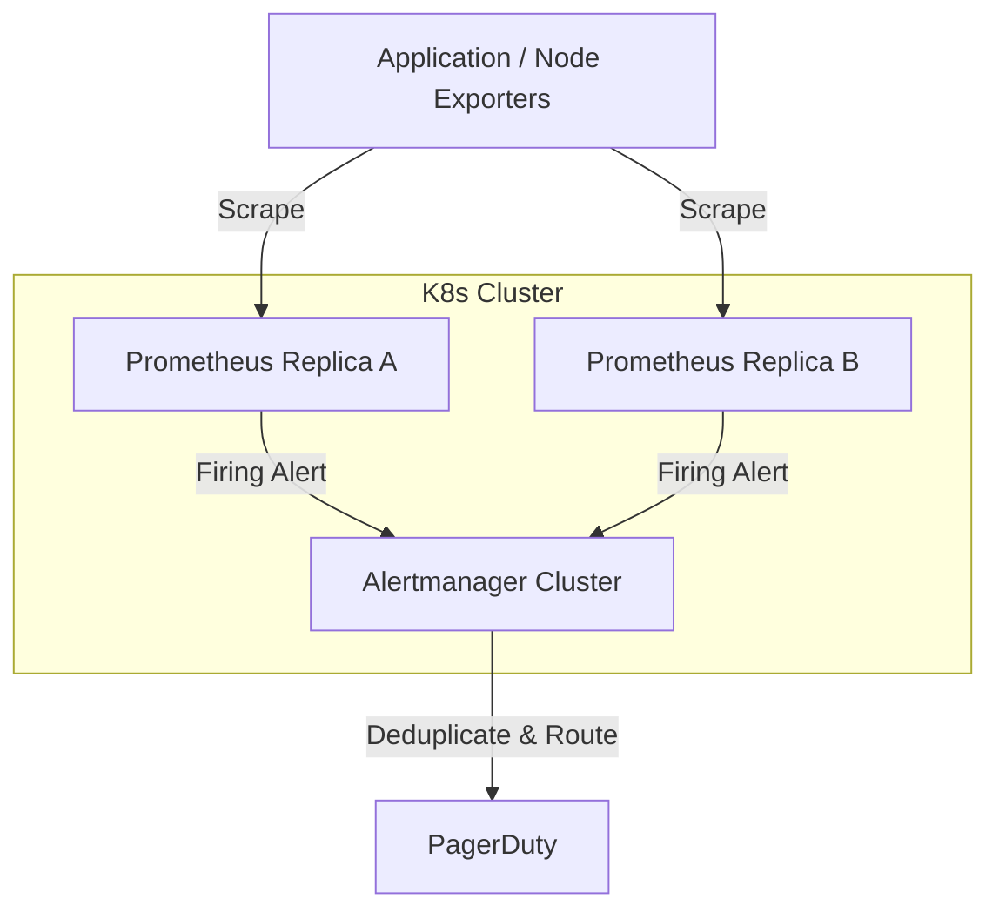
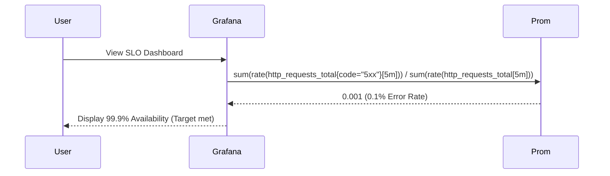
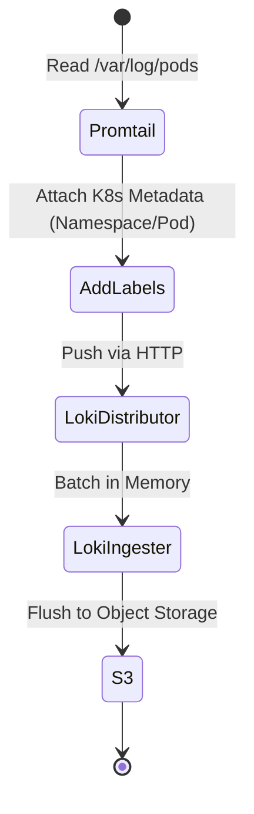

# Alerting & Architecture Diagrams

## 31. High-Availability Prometheus

```mermaid
graph TD
    subgraph "K8s Cluster"
        PromA[Prometheus Replica A]
        PromB[Prometheus Replica B]
        AlertMan[Alertmanager Cluster]
    end

    Target[Application / Node Exporters]
    
    Target -->|Scrape| PromA
    Target -->|Scrape| PromB
    
    PromA -->|Firing Alert| AlertMan
    PromB -->|Firing Alert| AlertMan
    
    AlertMan -->|Deduplicate & Route| PagerDuty[PagerDuty]
```

## 40. PromQL SLO Calculation

```mermaid
sequenceDiagram
    participant User
    participant Grafana
    participant Prom
    
    User->>Grafana: View SLO Dashboard
    Grafana->>Prom: sum(rate(http_requests_total{code="5xx"}[5m])) / sum(rate(http_requests_total[5m]))
    Prom-->>Grafana: 0.001 (0.1% Error Rate)
    Grafana-->>User: Display 99.9% Availability (Target met)
```

## 50. Loki Log Aggregation Flow

```mermaid
stateDiagram-v2
    [*] --> Promtail: Read /var/log/pods
    Promtail --> AddLabels: Attach K8s Metadata (Namespace/Pod)
    AddLabels --> LokiDistributor: Push via HTTP
    LokiDistributor --> LokiIngester: Batch in Memory
    LokiIngester --> S3: Flush to Object Storage
    S3 --> [*]
```
