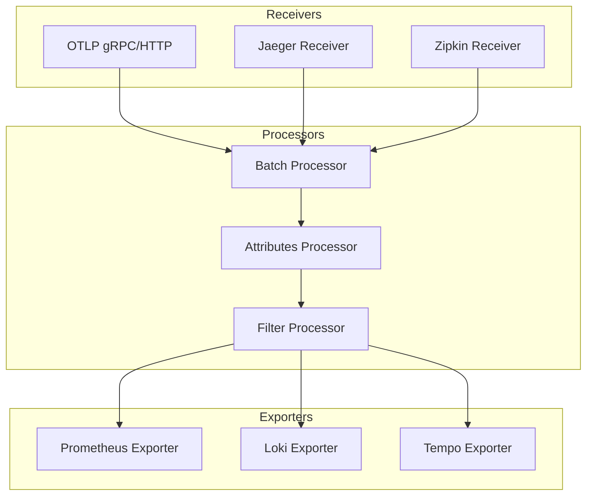
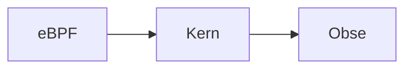
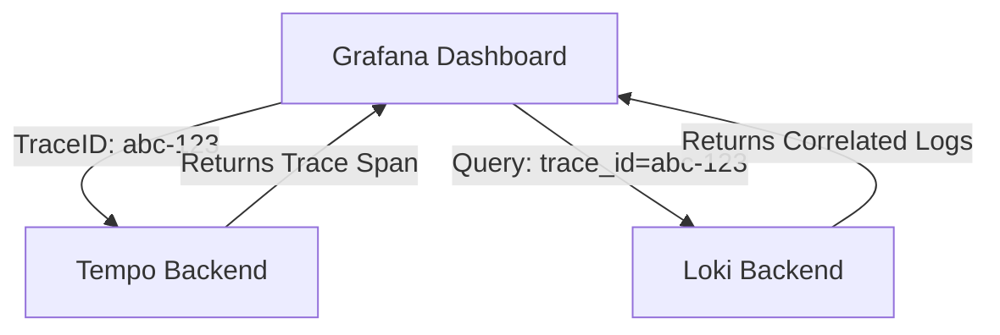
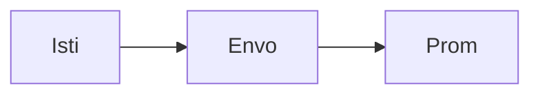

# Telemetry & Flow Architecture Diagrams

## 11. OpenTelemetry Collection Flow
*How the OTel Collector processes and routes telemetry data.*

## 15. eBPF CNI visibility

## 20. Trace to Log Correlation

## 25. Service mesh metrics

